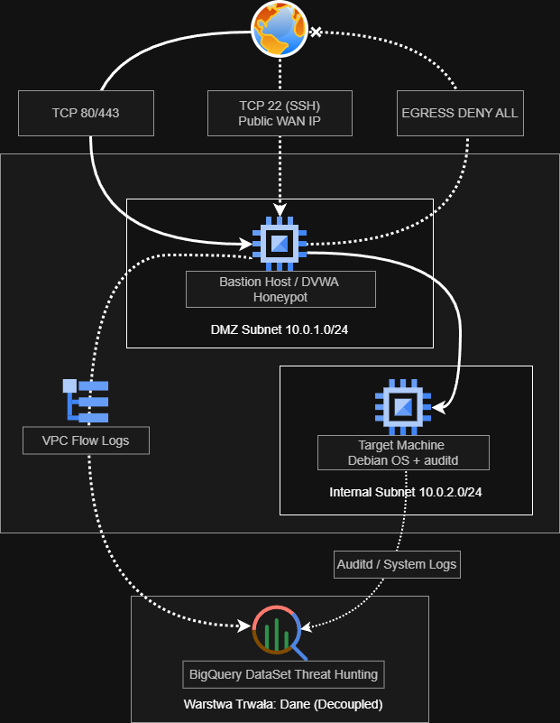

# GCP Enterprise Security Lab & DFIR Pipeline

Projekt symulujący środowisko Enterprise w modelu Infrastructure as Code (Terraform), z wydzieloną warstwą telemetrii SOC w BigQuery (Decoupled State) oraz zaporą w konfiguracji Egress DENY ALL.

## Architektura Sieciowa

*Szczegóły wdrożenia oraz pełny raport z incydentu (SANS/NIST) zostaną udostępnione wkrótce.*